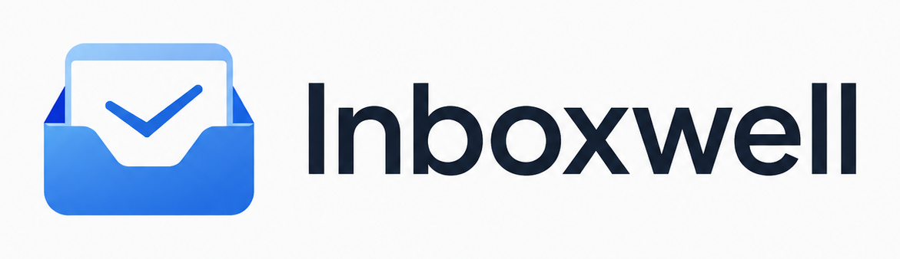
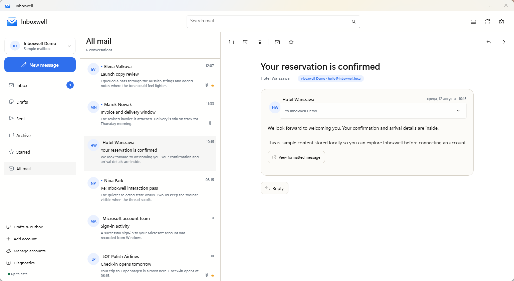

<p align="center">
  
</p>

<p align="center">
  A calm, private, open-source mail client for Windows 11.
</p>

Inboxwell brings Microsoft 365 / Exchange Online, Gmail, and standard IMAP/SMTP accounts into one polished WinUI 3 application. Its interface was designed in Pen.dev around a minimal, responsive three-pane layout, with an optional bottom reading pane.



> [!IMPORTANT]
> Inboxwell is usable for local development and personal testing, but it is not yet distributed with a public code-signing certificate or shared production OAuth applications. See [Project status](#project-status).

## Features

- multiple mailboxes and a unified inbox with clear account indicators;
- Microsoft 365 / Exchange Online through Microsoft Graph and OAuth 2.0;
- Gmail through the Gmail API and OAuth 2.0;
- IMAP/SMTP with SSL/TLS or STARTTLS;
- conversations, server folders, Gmail labels, stars, archive, move and delete;
- HTML and plain-text reading, inline replies, forwarding, signatures and attachments;
- rich-text composition, importance flags and expandable reply drafts that retain thread context;
- integrated drafts, autosave, an offline outbox and resumable background synchronization;
- responsive right or bottom reading panes, light/dark themes and Windows notifications;
- encrypted SQLCipher mail/search database and Windows Credential Manager secrets;
- script-free HTML rendering, blocked remote images and AES-GCM attachment cache.

## Requirements

- Windows 11 24H2 or newer (build 26100+);
- .NET SDK 10.0.400 or a compatible later patch;
- Visual Studio with Windows App SDK tooling, or the `dotnet` CLI.

## Build and run

```powershell
dotnet restore Inboxwell.slnx
dotnet build Inboxwell.slnx
dotnet run --project src/Gomail.App/Gomail.App.csproj
```

The source directories retain their original `Gomail.*` technical names so existing local installations, credentials and encrypted data remain upgrade-compatible. The product, executable, package display name and all visible branding are Inboxwell.

To create a locally signed x64 installer:

```powershell
.\scripts\Build-Installer.ps1
```

The resulting ZIP is written to `artifacts/Inboxwell-1.4.15-win-x64-installer.zip`. Extract it and run `Install-Inboxwell.ps1`. The included development certificate is intended only for builds you created or received from a trusted source.

## OAuth setup

### Microsoft 365

1. Create an app registration in Microsoft Entra ID.
2. Enable work, school and personal Microsoft accounts.
3. Add the **Mobile and desktop applications** platform with redirect URI `http://localhost`.
4. Add delegated permissions `User.Read`, `Mail.ReadWrite`, `Mail.Send` and `offline_access`.
5. In Inboxwell, open **Settings → Integrations**, enter the client ID and restart the app.

Exchange Online uses Microsoft Graph. On-premises Exchange can use IMAP/SMTP when enabled by the administrator.

### Gmail

1. Enable the Gmail API in Google Cloud Console.
2. Configure the OAuth consent screen and create a **Desktop app** OAuth client.
3. Add your addresses as test users while the consent screen is in Testing mode.
4. Configure a source build once with `./scripts/Configure-GoogleOAuth.ps1 -ClientJson <path-to-downloaded-json>`.

Official Inboxwell builds include their Google OAuth client, so people installing those builds never enter developer credentials. The private JSON is ignored by Git and is packaged only into locally produced release binaries.

Inboxwell requests `gmail.modify` to synchronize messages and labels, archive mail and update read state; `gmail.settings.basic` to read the mailbox's configured sender name; and OpenID `email`/`profile` identity scopes to label the connected account correctly.

For development automation, credentials can also be supplied through:

```text
INBOXWELL_MICROSOFT_CLIENT_ID
INBOXWELL_GMAIL_CLIENT_ID
INBOXWELL_GMAIL_CLIENT_SECRET
```

The previous `GOMAIL_*` names remain supported for upgrade compatibility. Never commit real OAuth secrets.

## Project status

The local mail engine, encrypted storage, account providers and core interface are implemented and covered by automated tests. Before broad public distribution, the project still needs production OAuth registrations, publisher verification, a trusted signing certificate or Microsoft Store publication, release automation and wider real-account testing.

## Repository map

- `src/Gomail.App` — WinUI interface and Windows integration;
- `src/Gomail.Core` — mail models, threading and synchronization engine;
- `src/Gomail.Data` — encrypted SQLite/FTS storage and offline queue;
- `src/Gomail.Providers` — Microsoft Graph, Gmail API, IMAP/SMTP and demo providers;
- `tests/Gomail.Tests` — storage, threading, provider and security tests;
- `design/inboxwell.pen` — editable Pen.dev design;
- `design/brand` — supplied and prepared Inboxwell brand assets;
- `docs/architecture.md` — architecture and security overview.

## Tests

```powershell
dotnet test tests/Gomail.Tests/Gomail.Tests.csproj -c Release
dotnet build Inboxwell.slnx -c Release
```

Tests use temporary encrypted databases and do not connect to real mailboxes.

Keyboard shortcuts: `Ctrl+N` compose, `Ctrl+F` search, `Ctrl+R` reply, `Ctrl+Enter` send, `F5` synchronize.

## Contributing and security

Contributions are welcome; see [CONTRIBUTING.md](CONTRIBUTING.md). Please report vulnerabilities privately as described in [SECURITY.md](SECURITY.md).

Inboxwell is released under the [MIT License](LICENSE).
