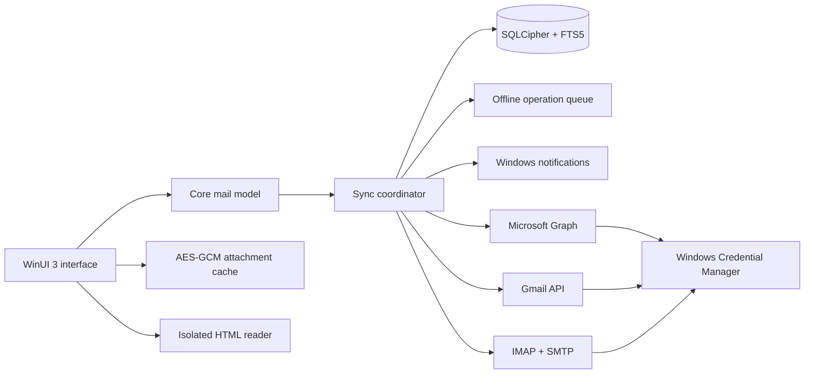

# Inboxwell architecture

Providers translate remote data into the shared `MailAccount`, `MailFolder`, `MailConversation` and `MailMessage` models. The interface reads from the local store, which keeps it fast and available offline. Synchronization idempotently updates local data; user actions apply locally first and then enter an outbound queue.

Microsoft Graph uses folder delta links, Gmail uses the History API, and the generic IMAP provider stores UID cursors while rechecking a compact summary window for servers without QRESYNC. Recent message bodies are cached locally; older results can be fetched on demand.

HTML is sanitized before storage and rendered in WebView2 with scripts, dialogs, host objects and autofill disabled. Remote images remain blocked until the user explicitly loads them. Downloaded attachments use AES-GCM containers, and clear copies exist only in the Windows temporary directory while opened.

OAuth tokens and IMAP passwords are stored in Windows Credential Manager. The mail database, full-text index, drafts and offline queue are protected with SQLCipher. The database and attachment encryption keys remain local and are never committed to this repository.
